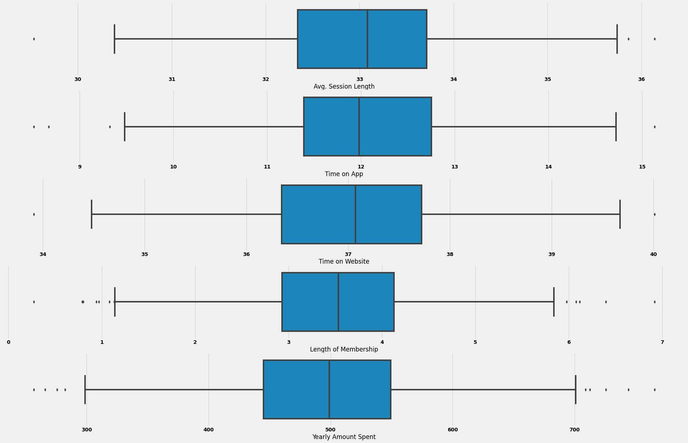

## Linear Regression  assumptions compliance:
1. Linear relationship = True
2. Multivariate normality: Que las distribuciones sean normales = True.
3. No or little multicolinearity = True or doesnt apply.
4. No auto-correlation = True. (The residuals are independent to eachother, they dont show corr on the scatter plot).
5. Homescedasticity. The residuals are equal accr


```python
import pandas as pd
import numpy as np
import matplotlib.pyplot as plt
import seaborn as sns
plt.rcParams['figure.figsize'] = [15,10]
plt.rcParams['font.size'] = 14
plt.rcParams['font.weight'] = 'bold'
plt.style.use('fivethirtyeight')

import warnings
warnings.filterwarnings('ignore')

from sklearn.model_selection import train_test_split
import statsmodels.api as sm

from sklearn.metrics import mean_squared_error, r2_score

import pickle 
import joblib
```

## Quick Inspection


```python
df = pd.read_csv('Ecommerce Customers.csv')
df = round(df,2)
df.sample(10)
```


<div>
<style scoped>
    .dataframe tbody tr th:only-of-type {
        vertical-align: middle;
    }

    .dataframe tbody tr th {
        vertical-align: top;
    }

    .dataframe thead th {
        text-align: right;
    }
</style>
<table border="1" class="dataframe">
  <thead>
    <tr style="text-align: right;">
      <th></th>
      <th>Email</th>
      <th>Address</th>
      <th>Avatar</th>
      <th>Avg. Session Length</th>
      <th>Time on App</th>
      <th>Time on Website</th>
      <th>Length of Membership</th>
      <th>Yearly Amount Spent</th>
    </tr>
  </thead>
  <tbody>
    <tr>
      <th>55</th>
      <td>amberchase@fowler.info</td>
      <td>1867 Gregory Isle Suite 022\nPort Tammy, LA 52...</td>
      <td>GreenYellow</td>
      <td>33.93</td>
      <td>11.59</td>
      <td>35.25</td>
      <td>3.39</td>
      <td>483.67</td>
    </tr>
    <tr>
      <th>53</th>
      <td>wbrady@yahoo.com</td>
      <td>044 Riggs Expressway\nLake Stevenchester, AL 2...</td>
      <td>SandyBrown</td>
      <td>33.76</td>
      <td>9.98</td>
      <td>35.93</td>
      <td>3.86</td>
      <td>451.46</td>
    </tr>
    <tr>
      <th>372</th>
      <td>mholt@hotmail.com</td>
      <td>486 Adams Hills\nNorth Walter, MS 18124</td>
      <td>LightSeaGreen</td>
      <td>31.83</td>
      <td>11.27</td>
      <td>36.96</td>
      <td>2.67</td>
      <td>385.15</td>
    </tr>
    <tr>
      <th>285</th>
      <td>ppowell@gmail.com</td>
      <td>74260 Carly Mews Suite 703\nJonesberg, OR 39594</td>
      <td>BlueViolet</td>
      <td>32.87</td>
      <td>12.09</td>
      <td>36.62</td>
      <td>3.05</td>
      <td>471.60</td>
    </tr>
    <tr>
      <th>75</th>
      <td>langmatthew@hotmail.com</td>
      <td>606 Perez Drives\nMaryside, CO 94387-5877</td>
      <td>DimGray</td>
      <td>32.05</td>
      <td>12.24</td>
      <td>38.73</td>
      <td>3.12</td>
      <td>478.72</td>
    </tr>
    <tr>
      <th>330</th>
      <td>dbenson@simpson.net</td>
      <td>732 Heather Place\nNorth Michael, VT 92527</td>
      <td>DodgerBlue</td>
      <td>30.57</td>
      <td>11.35</td>
      <td>37.09</td>
      <td>4.08</td>
      <td>442.06</td>
    </tr>
    <tr>
      <th>114</th>
      <td>hailey18@yahoo.com</td>
      <td>08079 Thompson Village\nNorth Lukeborough, AL ...</td>
      <td>Lime</td>
      <td>32.93</td>
      <td>12.73</td>
      <td>35.60</td>
      <td>5.49</td>
      <td>642.10</td>
    </tr>
    <tr>
      <th>282</th>
      <td>denisemorrow@johnson-james.net</td>
      <td>24458 Hudson Square\nHallside, PA 68038</td>
      <td>MediumSpringGreen</td>
      <td>31.65</td>
      <td>13.01</td>
      <td>37.79</td>
      <td>3.01</td>
      <td>475.26</td>
    </tr>
    <tr>
      <th>440</th>
      <td>hortonrobert@hotmail.com</td>
      <td>31309 Stacey Keys Apt. 979\nSouth Jason, KS 35357</td>
      <td>Salmon</td>
      <td>33.20</td>
      <td>11.97</td>
      <td>36.83</td>
      <td>3.55</td>
      <td>499.14</td>
    </tr>
    <tr>
      <th>393</th>
      <td>vancemichelle@gmail.com</td>
      <td>6586 Reginald Crest Apt. 061\nNorth Josephfort...</td>
      <td>DeepPink</td>
      <td>32.32</td>
      <td>12.42</td>
      <td>36.16</td>
      <td>3.22</td>
      <td>482.83</td>
    </tr>
  </tbody>
</table>
</div>


```python
df.info()
```

    <class 'pandas.core.frame.DataFrame'>
    RangeIndex: 500 entries, 0 to 499
    Data columns (total 8 columns):
     #   Column                Non-Null Count  Dtype  
    ---  ------                --------------  -----  
     0   Email                 500 non-null    object 
     1   Address               500 non-null    object 
     2   Avatar                500 non-null    object 
     3   Avg. Session Length   500 non-null    float64
     4   Time on App           500 non-null    float64
     5   Time on Website       500 non-null    float64
     6   Length of Membership  500 non-null    float64
     7   Yearly Amount Spent   500 non-null    float64
    dtypes: float64(5), object(3)
    memory usage: 31.4+ KB


## Cleaning


```python
df.isnull().sum()
```


    Email                   0
    Address                 0
    Avatar                  0
    Avg. Session Length     0
    Time on App             0
    Time on Website         0
    Length of Membership    0
    Yearly Amount Spent     0
    dtype: int64


```python
df.columns
```


    Index(['Email', 'Address', 'Avatar', 'Avg. Session Length', 'Time on App',
           'Time on Website', 'Length of Membership', 'Yearly Amount Spent'],
          dtype='object')


```python
numeric_cols = ['Avg. Session Length', 'Time on App',
       'Time on Website', 'Length of Membership', 'Yearly Amount Spent']
```


```python
zero = 0
fig, axs = plt.subplots(5, figsize=(30, 20))

for i in numeric_cols:
    plt1 = sns.boxplot(df[i], ax=axs[zero])
    zero = zero+1
```





```python

```


```python
#I will make a model with and without outliers
#Lets make a df without outlier
df.describe()
```


<div>
<style scoped>
    .dataframe tbody tr th:only-of-type {
        vertical-align: middle;
    }

    .dataframe tbody tr th {
        vertical-align: top;
    }

    .dataframe thead th {
        text-align: right;
    }
</style>
<table border="1" class="dataframe">
  <thead>
    <tr style="text-align: right;">
      <th></th>
      <th>Avg. Session Length</th>
      <th>Time on App</th>
      <th>Time on Website</th>
      <th>Length of Membership</th>
      <th>Yearly Amount Spent</th>
    </tr>
  </thead>
  <tbody>
    <tr>
      <th>count</th>
      <td>500.000000</td>
      <td>500.000000</td>
      <td>500.000000</td>
      <td>500.00000</td>
      <td>500.000000</td>
    </tr>
    <tr>
      <th>mean</th>
      <td>33.053340</td>
      <td>12.052620</td>
      <td>37.060480</td>
      <td>3.53336</td>
      <td>499.314240</td>
    </tr>
    <tr>
      <th>std</th>
      <td>0.992513</td>
      <td>0.994418</td>
      <td>1.010555</td>
      <td>0.99926</td>
      <td>79.314764</td>
    </tr>
    <tr>
      <th>min</th>
      <td>29.530000</td>
      <td>8.510000</td>
      <td>33.910000</td>
      <td>0.27000</td>
      <td>256.670000</td>
    </tr>
    <tr>
      <th>25%</th>
      <td>32.340000</td>
      <td>11.390000</td>
      <td>36.347500</td>
      <td>2.93000</td>
      <td>445.037500</td>
    </tr>
    <tr>
      <th>50%</th>
      <td>33.085000</td>
      <td>11.980000</td>
      <td>37.070000</td>
      <td>3.53500</td>
      <td>498.890000</td>
    </tr>
    <tr>
      <th>75%</th>
      <td>33.712500</td>
      <td>12.752500</td>
      <td>37.720000</td>
      <td>4.13000</td>
      <td>549.312500</td>
    </tr>
    <tr>
      <th>max</th>
      <td>36.140000</td>
      <td>15.130000</td>
      <td>40.010000</td>
      <td>6.92000</td>
      <td>765.520000</td>
    </tr>
  </tbody>
</table>
</div>


```python
sns.pairplot(df)
```


    <seaborn.axisgrid.PairGrid at 0x7fdf4d0599e8>


```python
sns.heatmap(df.corr(), annot=True)
```


    <AxesSubplot:>


```python
X = df['Length of Membership']
y = df['Yearly Amount Spent']
```


```python

```


```python
X_train, X_test, y_train, y_test = train_test_split(X,y, train_size=0.7, test_size=0.3, random_state=10)
```


```python
X_train.tail()
```


    320    1.20
    15     3.36
    484    2.78
    125    4.53
    265    4.26
    Name: Length of Membership, dtype: float64


```python
X_train_sm = sm.add_constant(X_train)
lr = sm.OLS(y_train, X_train_sm).fit()
```


```python
print(lr.summary())
```

                                 OLS Regression Results                            
    ===============================================================================
    Dep. Variable:     Yearly Amount Spent   R-squared:                       0.630
    Model:                             OLS   Adj. R-squared:                  0.629
    Method:                  Least Squares   F-statistic:                     592.8
    Date:                 Tue, 15 Jun 2021   Prob (F-statistic):           3.75e-77
    Time:                         09:52:57   Log-Likelihood:                -1837.1
    No. Observations:                  350   AIC:                             3678.
    Df Residuals:                      348   BIC:                             3686.
    Df Model:                            1                                         
    Covariance Type:             nonrobust                                         
    ========================================================================================
                               coef    std err          t      P>|t|      [0.025      0.975]
    ----------------------------------------------------------------------------------------
    const                  277.7970      9.205     30.180      0.000     259.693     295.901
    Length of Membership    62.1261      2.552     24.348      0.000      57.108      67.145
    ==============================================================================
    Omnibus:                        1.621   Durbin-Watson:                   1.897
    Prob(Omnibus):                  0.445   Jarque-Bera (JB):                1.710
    Skew:                           0.153   Prob(JB):                        0.425
    Kurtosis:                       2.848   Cond. No.                         14.4
    ==============================================================================
    
    Notes:
    [1] Standard Errors assume that the covariance matrix of the errors is correctly specified.


```python
plt.scatter(X_train, y_train)
plt.plot(X_train,277.79 +62.12*X_train, 'r' )
plt.show()
```


```python
lr.params
```


    const                   277.796983
    Length of Membership     62.126148
    dtype: float64


## Model evaluation


```python
y_train_pred = lr.predict(X_train_sm)
res = (y_train - y_train_pred)
```


```python
fig = plt.figure()
sns.distplot(res, bins = 15)
fig.suptitle('Error Terms', fontsize = 15)                  # Plot heading 
plt.xlabel('y_train - y_train_pred', fontsize = 15)         # X-label
plt.show()
```


```python
plt.scatter(X_train, res)
plt.show()
```


## Predictions on the test set


```python
X_test_sm = sm.add_constant(X_test)
y_pred = lr.predict(X_test_sm)
y_pred.head()
```


    151    675.404328
    424    467.281733
    154    517.603913
    190    565.441047
    131    583.457629
    dtype: float64


```python
lr.params
```


    const                   277.796983
    Length of Membership     62.126148
    dtype: float64


```python
np.sqrt(mean_squared_error(y_test, y_pred))

```


    47.97249428183935


```python
r_squared = r2_score(y_test, y_pred)
r_squared
```


    0.6845781148401262


```python
plt.scatter(X_test, y_test)
plt.plot(X_test, 277.79 +62.12*X_test, 'r' )
plt.show()
```


```python
X_test_sm = sm.add_constant(X_test)
y_pred_sm = asd.predict(X_test_sm)
y_pred_sm.head()
```


    151    675.404328
    424    467.281733
    154    517.603913
    190    565.441047
    131    583.457629
    dtype: float64


```python
X_train.head()
```


    84     4.40
    388    2.78
    149    3.99
    101    2.88
    451    2.40
    Name: Length of Membership, dtype: float64


```python
joblib.dump(lr, 'lr_portfolio.sav')
with open('lr_ecommerce.pkl', 'wb') as file:
    pickle.dump(lr,file)
```


```python
df.columns
```


    Index(['Email', 'Address', 'Avatar', 'Avg. Session Length', 'Time on App',
           'Time on Website', 'Length of Membership', 'Yearly Amount Spent'],
          dtype='object')


```python
predc = sm.add_constant(s)
preict = lr.predict(predc)
```


```python
preict
```


    0    420.687123
    1    476.600656
    dtype: float64


```python
X_test_sm.tail(10)
```


<div>
<style scoped>
    .dataframe tbody tr th:only-of-type {
        vertical-align: middle;
    }

    .dataframe tbody tr th {
        vertical-align: top;
    }

    .dataframe thead th {
        text-align: right;
    }
</style>
<table border="1" class="dataframe">
  <thead>
    <tr style="text-align: right;">
      <th></th>
      <th>const</th>
      <th>Length of Membership</th>
    </tr>
  </thead>
  <tbody>
    <tr>
      <th>367</th>
      <td>1.0</td>
      <td>2.90</td>
    </tr>
    <tr>
      <th>56</th>
      <td>1.0</td>
      <td>3.00</td>
    </tr>
    <tr>
      <th>37</th>
      <td>1.0</td>
      <td>3.45</td>
    </tr>
    <tr>
      <th>66</th>
      <td>1.0</td>
      <td>4.00</td>
    </tr>
    <tr>
      <th>458</th>
      <td>1.0</td>
      <td>4.20</td>
    </tr>
    <tr>
      <th>12</th>
      <td>1.0</td>
      <td>4.05</td>
    </tr>
    <tr>
      <th>97</th>
      <td>1.0</td>
      <td>4.25</td>
    </tr>
    <tr>
      <th>130</th>
      <td>1.0</td>
      <td>3.91</td>
    </tr>
    <tr>
      <th>472</th>
      <td>1.0</td>
      <td>3.14</td>
    </tr>
    <tr>
      <th>315</th>
      <td>1.0</td>
      <td>4.01</td>
    </tr>
  </tbody>
</table>
</div>


```python
predc.head(2)
```


<div>
<style scoped>
    .dataframe tbody tr th:only-of-type {
        vertical-align: middle;
    }

    .dataframe tbody tr th {
        vertical-align: top;
    }

    .dataframe thead th {
        text-align: right;
    }
</style>
<table border="1" class="dataframe">
  <thead>
    <tr style="text-align: right;">
      <th></th>
      <th>const</th>
      <th>Length of Membership</th>
    </tr>
  </thead>
  <tbody>
    <tr>
      <th>0</th>
      <td>1.0</td>
      <td>2.0</td>
    </tr>
    <tr>
      <th>1</th>
      <td>1.0</td>
      <td>3.0</td>
    </tr>
  </tbody>
</table>
</div>


```python
preict
```


    0    339.923131
    1    402.049279
    2    464.175426
    dtype: float64


```python
s = pd.Series([2.3,3.2], dtype=float, name='Length of Membership')
```


```python
omg = {'length':4}
omg.values()
rly = pd.Series(omg.values())
print(rly)
```

    0    4
    dtype: int64


```python
    data = dict()
    length_of_membership = data['length_of_membership']
    predicted_value = pd.Series(data['length_of_membership'], name='Length_of_Membership')
```


    ---------------------------------------------------------------------------

    KeyError                                  Traceback (most recent call last)

    <ipython-input-120-9203d6dcd26f> in <module>
          1 data = dict()
    ----> 2 length_of_membership = data['length_of_membership']
          3 predicted_value = pd.Series(data['length_of_membership'], name='Length_of_Membership')


    KeyError: 'length_of_membership'


```python

```
